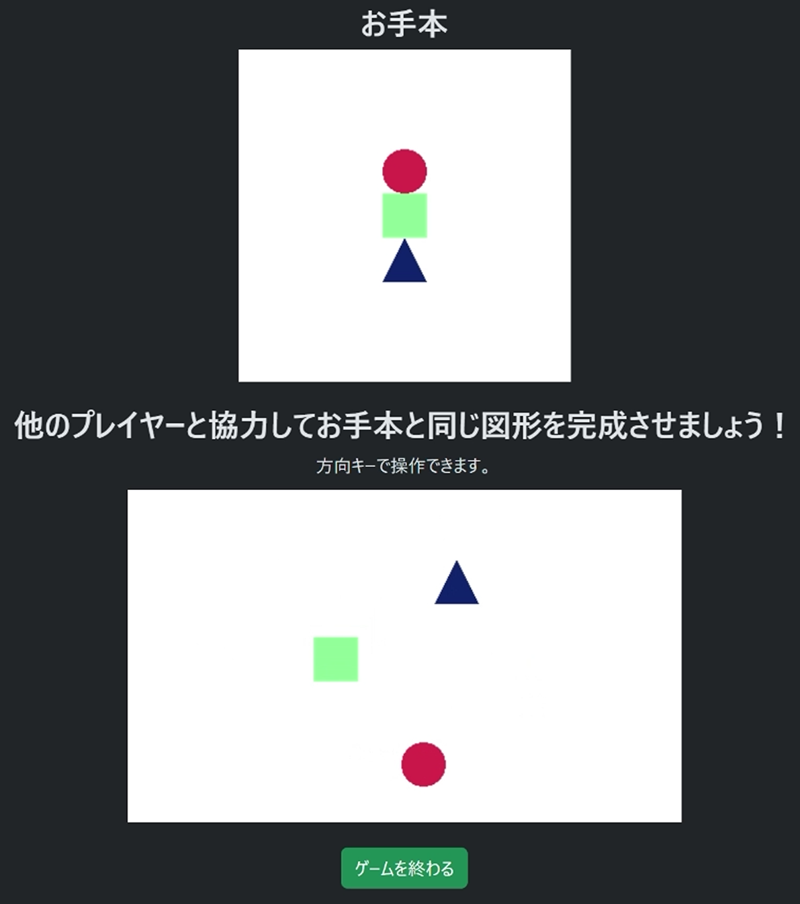
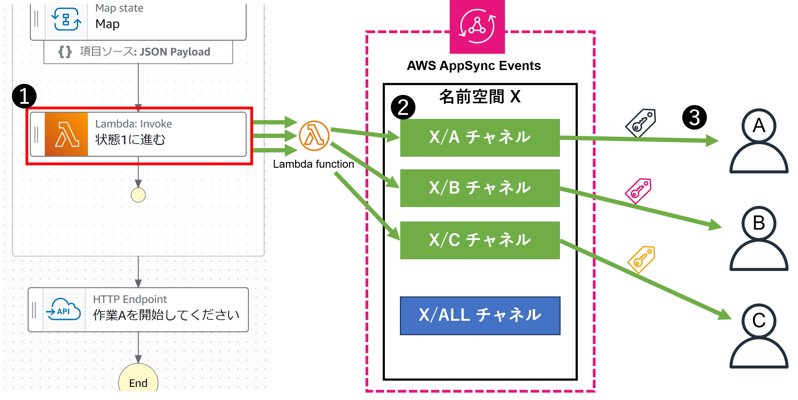
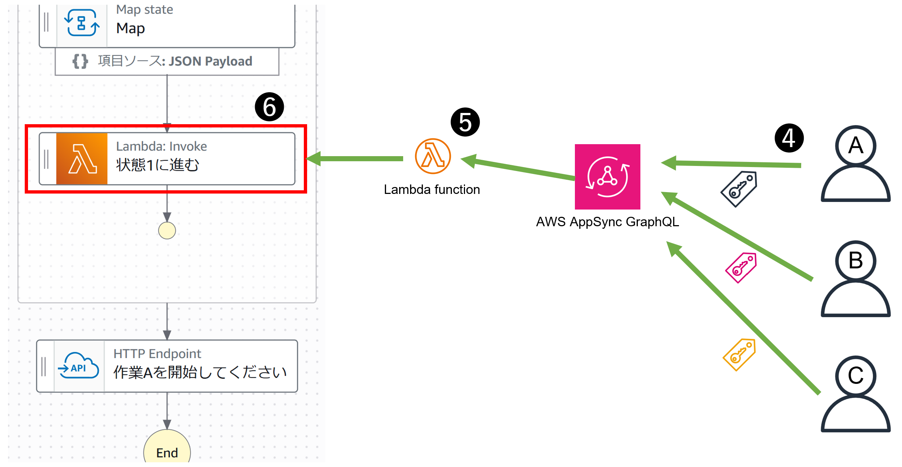
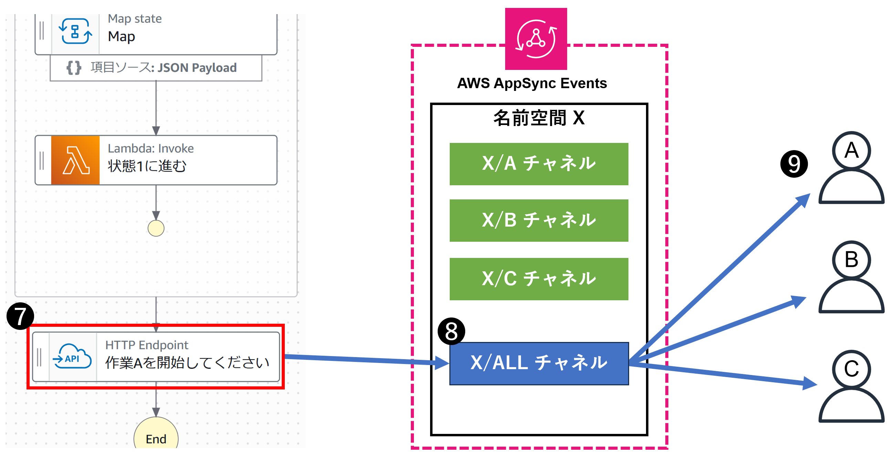
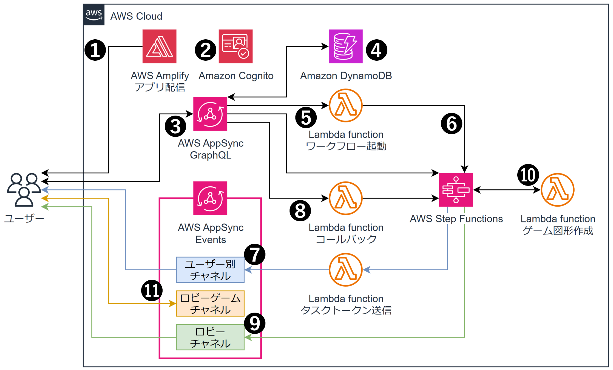

# マルチクライアント状態同期とリアルタイム通信を使用したオンラインゲーム

**プレイヤーごとにランダムな色と形の図形を割り当て、協力してお手本と同じ図形を完成させるゲームです。**
**AWS StepFunctionsとAWS AppSyncを使用したサーバーレスなオンラインゲームシステムです。**
**プレイヤーの状態を同期しつつ、リアルタイムに互いの状態を共有します。**

次のような特徴があります。

- Amazon Cognitoを使用したユーザー認証
- AWS StepFunctionsタスクトークンを使用したマルチクライアント状態同期
- AWS AppSync Eventsを使用したWebSocketによるマルチクライアント間リアルタイム通信
- AWS Amplify Gen2によるフロントエンドとバックエンドの効率的な開発

ブログ記事「[AWSで実現するマルチクライアント状態同期とリアルタイム](https://kkmtyyz.hatenablog.com/entry/2025/09/12/120750)」にて詳しく解説しています。

## 動作イメージ

## アーキテクチャ図

## デプロイ方法

- AWS CDKにて`cdk bootstrap`が完了している必要があります
- Amplify CI/CDでデプロイ。サンドボックスの場合は `$ npx ampx sandbox` を実行

## License
[MIT](./LICENSE-MIT)

